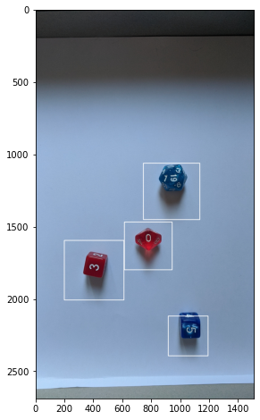
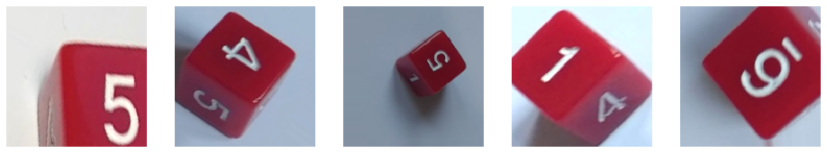
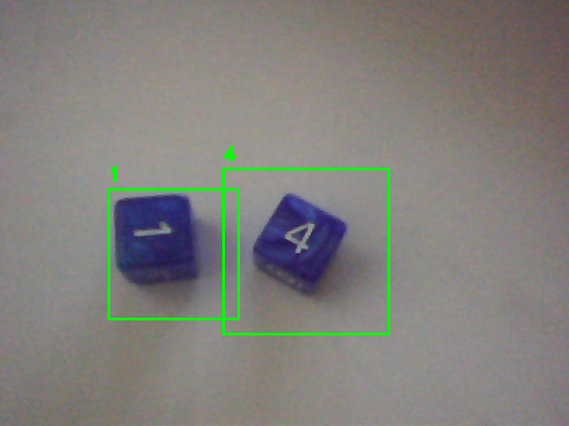

# Dice Scores Recognition in image/video

Image recognition is a hot topic with multiple applications. In this final project I used modern teqnniques to extract the number resulted from a dice throw in an image or a video.

To conduct this project I conducted the following steps:

- Build the train dataset using my camera to obtain multiple images.

- Segment images to extract the region of the dices.

- Used Convolutional Neural Networks (CNN), identified the dice type and computed the number.

- Adapted the code to work with images or live video using a webcam.


## Dataset creation

In order to create a dataset to train a CNN, I recorded videos of each number in each dice in different angles and different lights. After that I extracted the video frames, cropped them and save into image files. Some of these images were sent to the corresponding train folder and other to the test one (~20% test).


## Image segmentation

Using these fotograms, I trained a *Haar Cascade Classifier* with *OpenCV* and the *Cascade Trainer GUI* in order to be able to recognice the dices, following [this video tutorial](https://www.youtube.com/watch?v=v_cwOq06g9E) by [OMNES](https://github.com/GabySol/OmesTutorials2020). I recorded some background frames as well to provide to the Cascade Classifier positive and negative images. This provided a good detection of the dices as seen in the picture




With these image segmentation thecnique, I conducted one last preporoccesing to the image dataset. I selected better the region of the dice to extract more centered and focused images of the dices before training the CNN.

## CNN modeling

The initial dataset is augmented using *Keras*' `ImageDataGenerator` to take into account different angles of the dice, shifts with respect to the center of the square and changes in light.




I used *TensorFlow* in order to create and fit a CNN with the following parameters:

```
Model: "sequential"
_________________________________________________________________
Layer (type)                 Output Shape              Param #   
=================================================================
conv2d (Conv2D)              (None, 100, 100, 32)      896       
_________________________________________________________________
max_pooling2d (MaxPooling2D) (None, 50, 50, 32)        0         
_________________________________________________________________
conv2d_1 (Conv2D)            (None, 50, 50, 64)        18496     
_________________________________________________________________
max_pooling2d_1 (MaxPooling2 (None, 25, 25, 64)        0         
_________________________________________________________________
conv2d_2 (Conv2D)            (None, 25, 25, 128)       73856     
_________________________________________________________________
max_pooling2d_2 (MaxPooling2 (None, 12, 12, 128)       0         
_________________________________________________________________
conv2d_3 (Conv2D)            (None, 12, 12, 256)       295168    
_________________________________________________________________
max_pooling2d_3 (MaxPooling2 (None, 6, 6, 256)         0         
_________________________________________________________________
flatten (Flatten)            (None, 9216)              0         
_________________________________________________________________
dense (Dense)                (None, 10)                92170     
=================================================================
Total params: 480,586
Trainable params: 480,586
Non-trainable params: 0
```

I used this schema to fit the D6 and D10 dices.

## Score recognition in images and video

After that we have prepared all the tools necessary to build this project. I used photos of dices in different positions as seen in the image from the "Image Segmentation" section to predict the scores of several dice throws.

- The D6 dices are almost generally predicted, except for maybe blurry images or with some shiny spots in dices that make the algorithm confused
- The D10 dices are more problemaric due to the particular shape, but even so, a fraction much higher than the random 10% is guessed. In particular, some dices that are seen with some angle are missclasified.

Finally I could connect the webcam with the python code, so I can test my approach in real time using *OpenCV*. Each frame is processed by the Cascade Classifier and the CNN is applied to each detected dice region.




## Final thougts

I used *homemade* methods to create the sample and to process the images and videos. Even so, and taking into account that this was done in one week, the CNN and OpenCV are able to perform high quality detection and classification of objects. This kind of works have a great potential in a wide range of fields.


